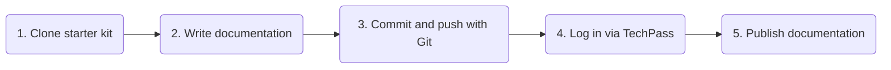

# What is the Developer Portal Documentation Service?

The Developer Portal Documentation Service enables developers to write project documentation with markdown files in their own git repositories. The documentation is then automatically synced and published to the documentation portal.

## Why is technical documentation necessary?

Technical documentation is crucial for users to understand and use your software and its APIs. It helps you support customers better while significantly [improving user satisfaction with your product.](https://www.sciencedirect.com/science/article/abs/pii/037872069090063N)

## Public and private documentation

You can choose who can access your documentation: the public, logged-in users*, or users with specific emails or email domains.

* only TechPass users

## Write in markdown or OpenAPI/Swagger

The developer documentation portal supports two documentation formats:

- Markdown, rendered with the [Docsify](https://docsify.js.org) documentation renderer.
- OpenAPI (also known as Swagger) definitions in JSON or YAML, rendered through the [ReDoc](https://github.com/redocly/redoc) API documentation renderer.

## How to publish documentation

Follow these steps to publish your documentation:

We have a template that you can download to get started. You can use either GitLab or GitHub for version control.

Template that you can clone to get started: [SGTS DevPortal Docs Portal Content Starter Kit](https://sgts.gitlab-dedicated.com/innersource/sgts/devportal/docs-portal-content-starter-kit)

 You will need a TechPass and Gitlab or GitHub account. [Get started](get-started) today!

