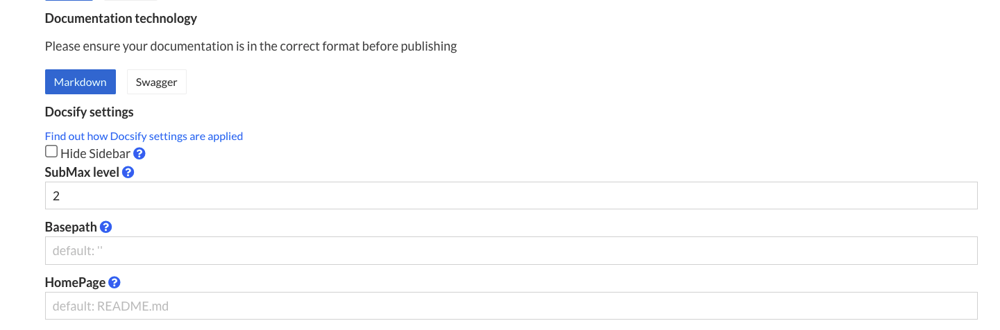

## Default configuration

Developer documentation portal uses a set of default Docsify settings and styles to render your documentation.
**It does not read from your repository's `index.html` file.**
Some of these settings are configurable [from the portal](#manual-configuration).

To see exactly how your own documentation pages would look like on Documentation
Portal, use the following `window.$docsify` settings in your index.html file.
To understand the items that are `configurable when publishing`, see
[below](#manual-configuration).

```html
<!DOCTYPE html>
<html>
  <head>
    <meta charset="UTF-8">
    <title>My New Documentation</title>
    <meta http-equiv="X-UA-Compatible" content="IE=edge,chrome=1" />
    <meta name="viewport" content="width=device-width, user-scalable=no, initial-scale=1.0, maximum-scale=1.0, minimum-scale=1.0">

    <!-- Configurable when publishing; useful for search engine optimization -->
    <meta name="description" content="My Documentation Description">

    <!-- Import for developer documentation portal styles -->
    <link
      rel="stylesheet"
      href="//cdn.jsdelivr.net/npm/@docs-gov-sg/doc-theme-default/public/dist/doc.css"
    />
  </head>
  <body>
    <div id="app"></div>

    <script>
      window.$docsify = {
        name: "My Documentation", // Must configure when publishing
        hideSidebar: false, // Configurable when publishing
        subMaxLevel: 2, // Configurable when publishing
        basePath: "", // Configurable when publishing
        homepage: "README.md", // Configurable when publishing
        el: "#app",
        auto2top: true,
        loadSidebar: true,
        subMaxLevel: 2, // For automatic 2nd level headings
        themeColor: "#0076d6"
      };
    </script>

    <!-- Imports for documentation functionality on developer documentation portal  -->
    <script src="//cdn.jsdelivr.net/npm/docsify/lib/docsify.min.js"></script>
    <script src="//cdn.jsdelivr.net/npm/docsify-copy-code"></script>
    <script src="//cdn.jsdelivr.net/npm/docsify/lib/plugins/zoom-image.min.js"></script>
    <script src="//cdn.jsdelivr.net/npm/docsify-pagination/dist/docsify-pagination.min.js"></script>
    <script src="//cdn.jsdelivr.net/npm/docsify-tabs/dist/docsify-tabs.min.js"></script>
  </body>
</html>
```

## Manual configuration



You can specify certain configurations that would be present on the`window.$docsify` object when publishing.

### Documentation display name

This takes the value set for your documentation's display name, which would show up in places such as links to your documentation, the sidebar and the title of the HTML document seen by readers.

### hideSidebar

Enable this to completely hide your sidebar.

Defaults to `false`.

### basePath

If have your markdown files or other assets reside in an inner directory of your git repo, set this to the name of that directory.

Defaults to empty string (`''`), which results in the root folder of your repository being served.

### homepage

File name for your home page, which is the page that gets served when readers navigate to your doc, e.g. `readme.md`, `README.md`, `home.md`.

Defaults to `README.md`
