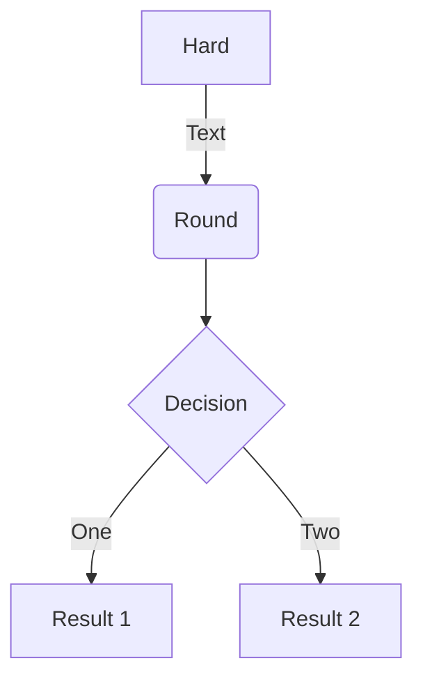
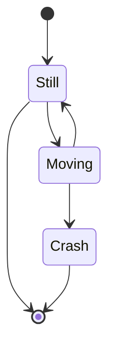
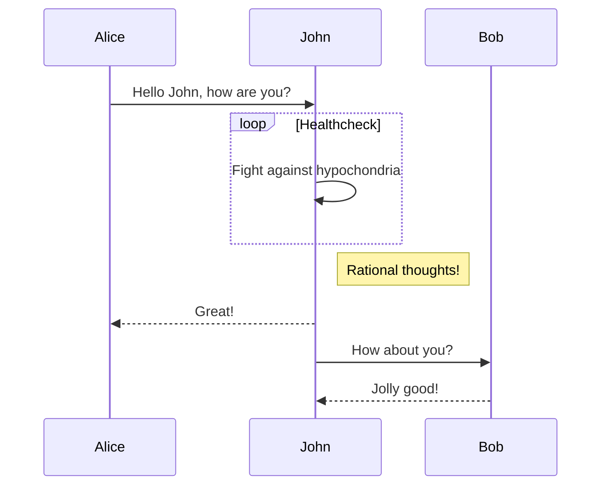
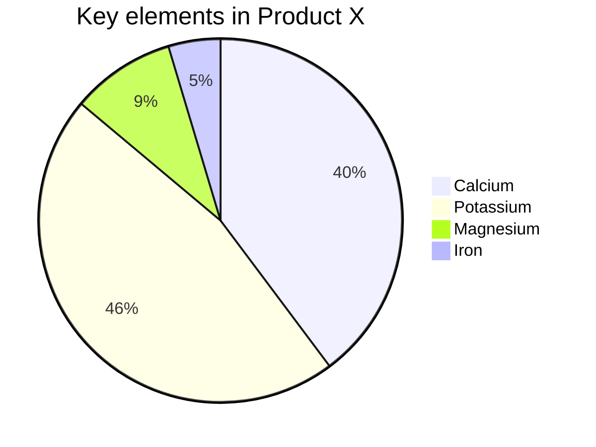

# [Mermaid](https://mermaid-js.github.io/mermaid) diagrams

Mermaid is a tool that enables you to write diagrams and flowcharts using Markdown. It
is supported out of the box on Documentation Portal.

Some examples of Mermaid diagrams can be found [below](#flowcharts). For usage instructions
and the full range of supported diagrams,
visit [https://mermaid-js.github.io/mermaid](https://mermaid-js.github.io/mermaid).

To view Mermaid diagrams on your local Docsify server, import Mermaid
and edit your Docsify
configuration in your `index.html` file as shown below:

```html
<body>

  <!-- Import mermaid.js, BEFORE the window.$docsify initialisation -->
  <script src="//cdn.jsdelivr.net/npm/mermaid/dist/mermaid.min.js"></script>
  <script>
    // Add the two lines below
    var num = 0;
    mermaid.initialize({ startOnLoad: false });
    // Add the "markdown" option to window.$docsify in addition to the other config
    window.$docsify = {
      ...otherDocsifyConfig,
      markdown: {
        renderer: {
          code: function (code, lang) {
            if (lang === "mermaid") {
              return (
                '<div class="mermaid">' +
                mermaid.render("mermaid-svg-" + num++, code) +
                "</div>"
              );
            }
            return this.origin.code.apply(this, arguments);
          },
        },
      },
    };
  </script>
  <!-- ...other imports -->
</body>
```

## Writing Mermaid diagrams

To write a Mermaid diagram, simply use a code block with the language type set to `mermaid`:

``````

``````

Renders


## Examples

### Flowcharts

```
graph TD
A[Hard] -->|Text| B(Round)
B --> C{Decision}
C -->|One| D[Result 1]
C -->|Two| E[Result 2]
```



### State Diagrams

```
stateDiagram
    [*] --> Still
    Still --> [*]

    Still --> Moving
    Moving --> Still
    Moving --> Crash
    Crash --> [*]
```



### Sequence Diagrams

```
sequenceDiagram
Alice->>John: Hello John, how are you?
loop Healthcheck
    John->>John: Fight against hypochondria
end
Note right of John: Rational thoughts!
John-->>Alice: Great!
John->>Bob: How about you?
Bob-->>John: Jolly good!
```



### Pie Charts

```
pie
    title Key elements in Product X
    "Calcium" : 42.96
    "Potassium" : 50.05
    "Magnesium" : 10.01
    "Iron" :  5
```


