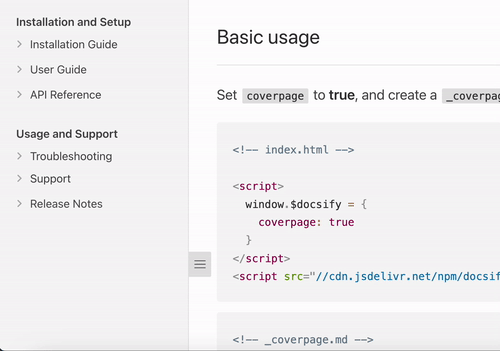

# Using the Sidebar Plugin

The Sidebar plugin allows you to nest your page links into interactive folders
you can collapse and uncollapse!

## Setup

### Step 1: Configure docsify-sidebar-collapse plugin

Add the following code to the HTML file where you initialize Docsify:

```html
	window.$docsify = {
		enableSidebarCollapse: true
	};
```

This configuration enables the plugin to toggle on or off.

### Step 2: Insert style/script into 

Insert the necessary styles and scripts into your Docsify document. Ensure the 
following code is inside the `head` section of you HTML file:

```html
<head>
    <link rel="stylesheet" href="//cdn.jsdelivr.net/npm/@sg-developer-portal/doc-theme-default@0.0.13/public/dist/doc.css">
</head>
```

This code imports the required CSS stylesheets for the theme of the Docisfy page.

Add the following code to the <body> section of your HTML file:

```html
<body>
    <script src="//cdn.jsdelivr.net/npm/@lx0f/docsify-sidebar-collapse@latest/dist/docsify-sidebar-collapse.bundle.js"></script>
</body>
```

This code imports the JavaScript file for the docsify-sidebar-collapse plugin.

### Step 3: Create/Update your sidebar markdown file

To create a top level category/section:

```md
Category/Section

- Links
...
```

To create a folder:

```md
- Folder
    - [Link](link/to/file)
```

To create a link folder:

```md
- [Link Folder](link/to/file)
    - [Nested Link](link/to/another/file)
```

## Example

### Markdown

```md
Installation and Setup

- Installation Guide
    - [Windows Installation](install-guide/windows)
    - [Mac Installation](install-guide/mac)
    - [Linux Installation](install-guide/linux)
- [User Guide](user-guide/overview)
    - [Getting Started](user-guide/getting-started)
    - [Configuration](user-guide/configuration)
- API Reference
    - [API Documentation](api-reference/api-documentation)

Usage and Support

- Troubleshooting
    - Common Issues
        - [Error Messages](troubleshooting/error-messages)
        - [Troubleshooting FAQ](troubleshooting/faq)
    - [Known Issues](troubleshooting/known-issues)
- Support
    - [Contact Us](support/contact-us)
    - [Community Forums](support/community-forums)
- [Release Notes](release-notes/overview)
    - [Version 1.0](release-notes/v1.0)
    - [Version 2.0](release-notes/v2.0)
```

### Output



