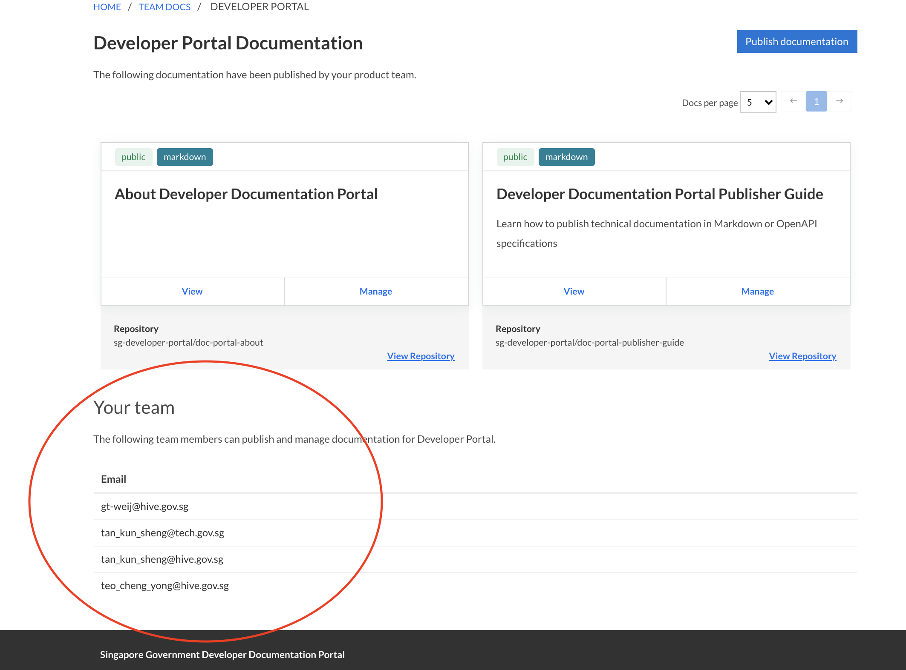
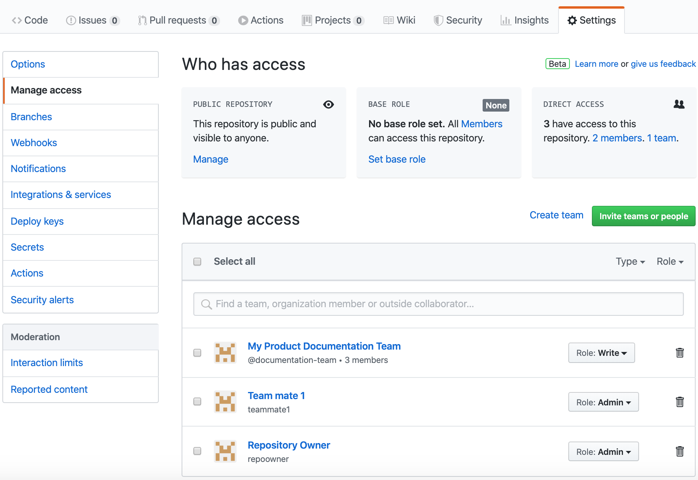

## Working in teams
<!-- todo: add a segment about Product Teams -->

### Developer's Portal

> **Products** are government digital solutions which requires documenting. Examples of Products are TechPass, SHIP Hats, NDI, etc. 

Each document is published under a Product and maintained by all users of the Product's Team. 

Please approach the Developer's Portal team for your Product to be created so that you may begin writing and publishing documentation for it. You will also need to provide a list of TechPass emails to be added into the Product's Team and in doing so, all members in the team will be able to manage and publish documentation for the Product.

You may view the team member details of your Product by browsing to `Team Docs` from the navigation bar and then selecting a Product. Refer to the below image.

All members in the Product will be able to manage document settings on Developer's Portal. For example, changing the document's display name, the git branch from which it is published from and more.

For collaboration with regards to the documentation's contents on GitHub's repositories, see below.
### GitHub

> GitHub private repositories for personal and team accounts are [free of charge](https://github.com/pricing).

If your documentation is maintained by a team, you can either:

- Use a personal account and invite individual collaborators

  This allows you to work on public and private repositories. However, only the _owner_ of the GitHub repository will be able to publish
  or unpublish documentation on the developer documentation portal.

- Use teams in a GitHub organisation account

  Your documentation repository would need to belong to a GitHub team/organisation. From there, you can create a team, invite team members and give the team
  read/write permissions to your repository. You can similarly grant individuals access to your repository.

  Any individual or team with `admin` level access to the repository would be able to publish/unpublish that documentation from the documentation portal.

  An example of an organisation repository's access configuration is shown below. In this example, only `Team mate 1` and `Repository Owner` have the rights to publish/unpublish the documentation from the documentation portal.

  

  > For your convenience, you can use the [developer documentation portal's GitHub organisation](https://github.com/sg-developer-portal) to host your documentation repositories.
  > Contact gds_developer_portal@tech.gov.sg to find out more.

## Configuring permissions for readers

If you publish a project in `public` mode, it will be publicly accessible from the internet.

If you choose `private` mode, only users logged in to developer documentation portal through TechPass will be able to see it. 

In private mode, you can also set specific access controls via email domains or specific emails. For example, access granted for `tech.gov.sg` and `john@example.gov.sg` allows all users with a tech.gov.sg email as well as the user whose email is john@example.gov.sg to read your published documentation.

You can also specify the category that your documentation belongs to. For a complete description of publishing settings, see [advanced settings](advanced/publishing-settings).
