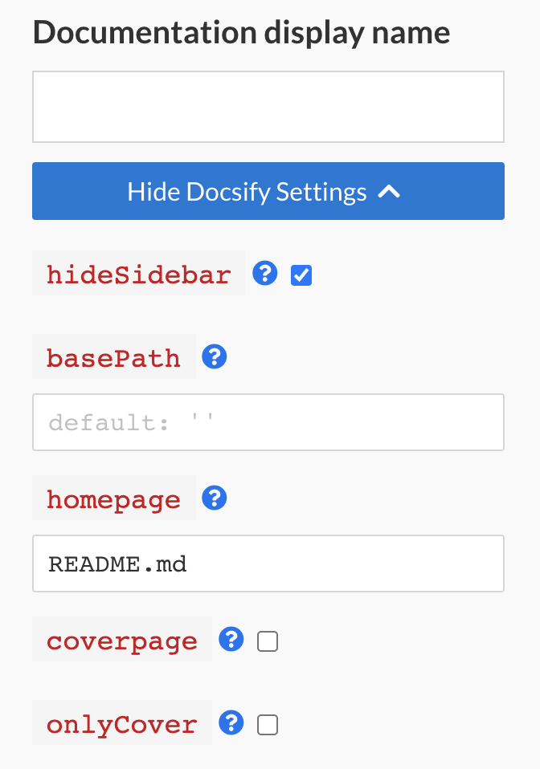

# Docsify configuration

Documentation portal uses a set of default Docsify settings and styles to render your documentation.
It does not read from your repository's `index.html` file.
Some of these settings are configurable [from the portal](#manually-configurable-docsify-settings).

To see exactly how your own documentation pages would look like on Documentation
Portal, use the following `window.$docsify` settings in your index.html file.
To understand the items that are `configurable when publishing`, see 
[below](#manually-configurable-docsify-settings).

```html
<!DOCTYPE html>
<html>
  <head>
    <!-- Import for documentation portal styles -->
    <link
      rel="stylesheet"
      href="//cdn.jsdelivr.net/npm/@docs-gov-sg/doc-theme-default/public/dist/doc.css"
    />
  </head>
  <body>
    <div id="app"></div>

    <script>
      window.$docsify = {
        name: "My Documentation", // Must configure when publishing
        hideSidebar: false, // Configurable when publishing
        basePath: "", // Configurable when publishing
        homepage: "README.md", // Configurable when publishing
        coverpage: false, // Configurable when publishing
        onlyCover: false, // Configurable when publishing
        el: "#app",
        auto2top: true,
        loadSidebar: true,
        subMaxLevel: 2, // For automatic 2nd level headings
        themeColor: "#0076d6",
        search: "auto", // Enable search based on pages defined on your sidebar
      };
    </script>

    <!-- Imports for documentation functionality on documentation portal  -->
    <script src="//cdn.jsdelivr.net/npm/docsify/lib/docsify.min.js"></script>
    <script src="//cdn.jsdelivr.net/npm/docsify/lib/plugins/search.min.js"></script>
    <script src="//cdn.jsdelivr.net/npm/docsify-copy-code"></script>
    <script src="//cdn.jsdelivr.net/npm/docsify/lib/plugins/zoom-image.min.js"></script>
  </body>
</html>
```

## Manually configurable Docsify settings



You can specify certain configurations that would be present on the`window.$docsify` object when publishing.

### name

This takes the value set for your documentation's display name

### hideSidebar

Enable this to completely hide your sidebar.

Defaults to `false`.

### basePath

If you want to have your markdown files or other assets reside in an inner directory of your git repo, e.g. docs/

Defaults to empty string (`''`)

### homepage

File name for your home page.

Defaults to `README.md`

### coverpage

Enable this to render a cover page.

Defaults to `false`.

### onlyCover

Enable this to only present the cover page as your home page.

Defaults to `false`.
