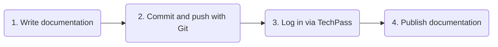
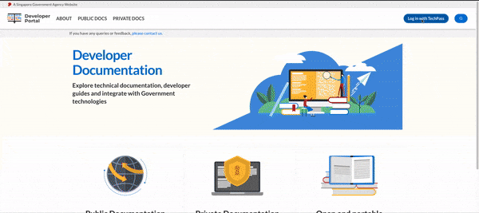
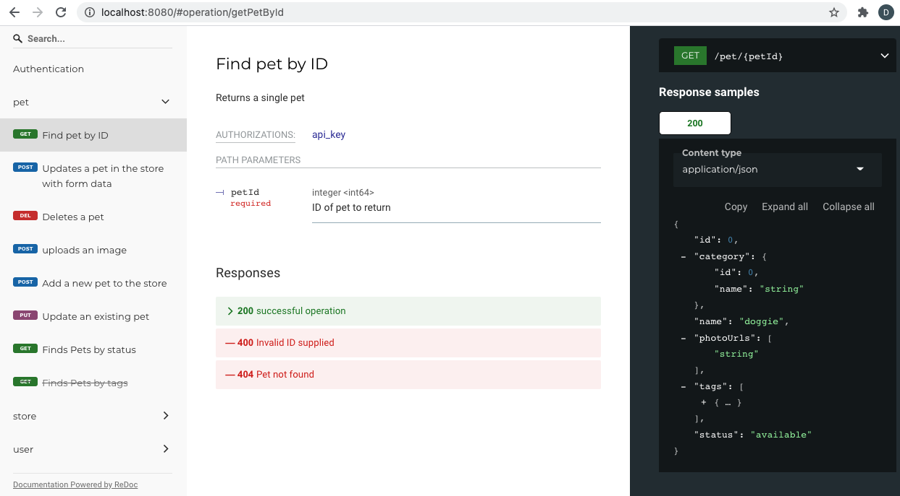
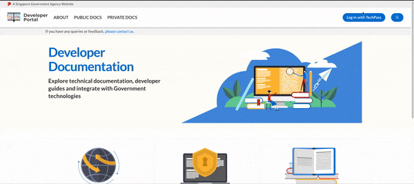
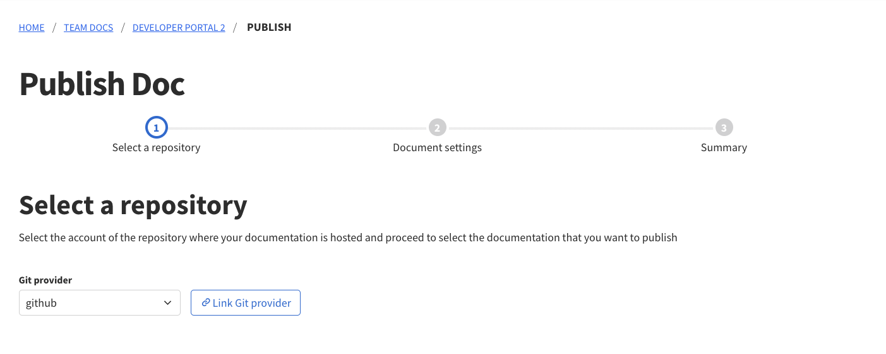
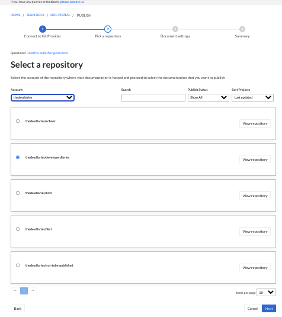
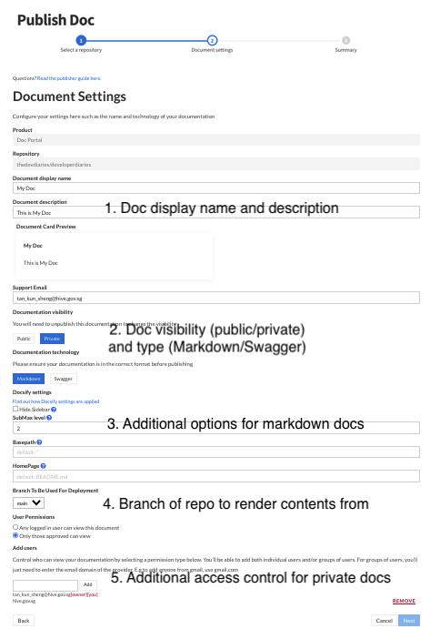
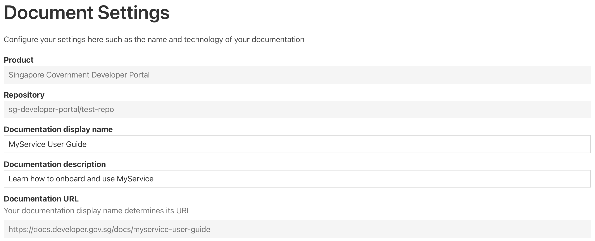
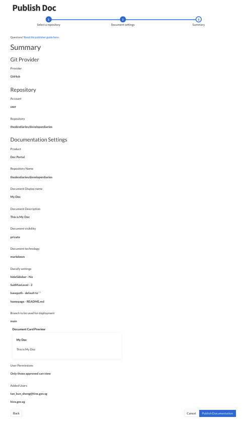
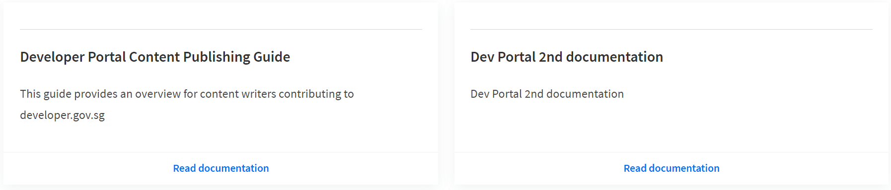

# Overview
<!-- todo: update this diagram -->
<!--  -->


## Prerequisites
The developer portal documentation service syncs up your documentation repository containing Markdown or OpenAPI(Swagger) files and hosts them as documentation pages.

You will need:

1. A [TechPass](https://www.techpass.gov.sg) account to log in and host your documentation.
2. A free [github.com](https://github.com) account to host your documentation's git repository.
3. *To be onboarded as a publisher on the Documentation Service.

?> *To onboard as a publisher, please reach out to the Developer Portal Team [via email](mailto:gds_developer_portal@tech.gov.sg).

You can publish 2 types of documentation:

1. Markdown. This requires you to commit a directory of documentation markdown files to a GitHub repository with a `_sidebar.md` file to format the side navigation for documentation readers.

2. OpenAPI/Swagger. This requires you to commit a swagger file to a GitHub repository.

You can then publish your documentation on the Documentation Service via our publisher app (see detailed steps below).

## Overview of steps
<div style="text-align:center">
   
</div>

1. Write and preview your documentation on your machine with tools such as [Docsify](/get-started?id=create-and-preview-markdown) for Markdown, and [ReDoc](/get-started?id=preview-oas) for OpenAPI
2. Create a GitHub repository and push your documentation to it
3. Log in to the documentation service with your TechPass account
4. Go through the guided publishing flow via the [publisher app](https://docs.developer.gov.sg/teamdocs/products).

## Quickstart

The two types of documentation that you can publish are:
1. Markdown 
2. Open API Specification / Swagger

The following examples show you how to get started with the creation of such docs, and also how to serve them on your local machines so that you can have a preview of how they would look like when published.

<!-- tabs:start -->

### **1a. Markdown**
#### Create and Preview Markdown

You can write your documentation as a series of markdown files stored on github.com, which would be rendered by the documentation portal as documentation pages.


The easiest way to get started with writing documentation is to use a tool called [Docsify](https://docsify.js.org), which can help you visualize the documentation pages you are writing in markdown.

1. You will need to have Node.js and NPM installed on your machine. Use the [official installer](https://nodejs.org/en/) or the [nvm tool](https://github.com/nvm-sh/nvm).

2. Create a Git repository to hold your documentation.

   ```bash
   mkdir my-docs
   cd my-docs
   git init
   ```

3. Use the [Docsify CLI](https://docsify.js.org/#/quickstart) to generate a documentation site. This creates an index.html file along with a few markdown text files in your directory.

   ```bash
   # Initialize the documentation folder with index.html and some .md files
   npx docsify-cli init .
   ```

4. Start up a live-reloading server for your documentation. Open a browser and view it at http://localhost:3000.

   ```bash
   # View your documentation at http://localhost:3000
   docsify serve .
   ```

5. Commit your markdown files

   ```bash
   git add --all
   git commit -m "Initial commit"
   ```

### **1b. OpenAPI Spec**

From the [official OpenAPI specification site](https://swagger.io/specification):

> The OpenAPI Specification (OAS) defines a standard, language-agnostic interface to RESTful APIs which allows both humans and computers to discover and understand the capabilities of the service without access to source code, documentation, or through network traffic inspection.
>
> An OpenAPI document (or set of documents) defines or describes an API. An OpenAPI definition uses and conforms to the OpenAPI Specification.

You can define an OpenAPI or Swagger document in `yaml` or `json` and publish that on the developer documentation portal. It would be rendered as a human-readable page using the [ReDoc](https://github.com/Redocly/redoc) engine.

#### Preview OpenAPI
You can use the [redoc CLI](https://github.com/Redocly/redoc/tree/master/cli) to preview how your API documentation would look like. You will need to have Node.js and NPM installed on your machine. Use the [official installer](https://nodejs.org/en/) or the [nvm tool](https://github.com/nvm-sh/nvm).

```bash
npm i -g redoc-cli
redoc-cli serve swagger.yml
```

You can then navigate to http://localhost:8080 to preview your rendered API documentation:



<!-- tabs:end -->

### 2. Push to GitHub
After your Markdown or OpenAPI documentation is prepared, push it to GitHub.

[Create a new github.com repository](https://github.com/new) (this can be either public or private) and follow
the instructions on GitHub to push your new repository to that project.

```bash
# Either SSH authentication
git remote add origin git@github.com/my-username/my-project.git
# Or HTTP
git remote add origin https://github.com/my-username/my-project.git

# Push to the master branch of your GitHub project
git push -u origin master
```
>For **Markdown Docs**, your home page defaults to your `README.md` file at the **root** of your project.
>
>For **OpenAPI/Swagger Docs**, you should use a YAML (.yml or .yaml extension) or JSON (.json extension) file.

### 3. Log in and access your Product space

<div style="text-align:center">
   
</div>

Log in to the developer documentation portal by clicking on `Log in with TechPass` on the navigation bar. 

Navigate to `Team Docs` to find the products what you can publish documentation for.

Select the Product of which you are intending to publish documentation for, then click on the "Publish documentation" button. 

### 4. Publish your documentation with the guided Publishing Wizard

The publishing wizard will guide you through the steps required to get your documentation published.
#### Step 1. Select a Git Provider



In this step, you select a git provider (only GitHub available for now, but more options are coming soon!) and authorise your account to the documentation service with the necessary permissions to perform publishing.

If this is your first time publishing a document, and you have not authorised your GitHub account to us before, you will be prompted to do so when you click next.

#### Step 2. Select a Repository

<div style="text-align:center">
   
</div>

In this step, you select a repository from your GitHub account to link up to your to-be published documentation. Your personal repositories along with the repositories of any organisation/teams of which your GitHub account is an admin of, will be available for selection. You can toggle these options under the 'Account' dropdown selection.

#### Step 3. Enter Document Details

<div style="text-align:center">
   
</div>

In this step, you provide details regarding how you want your documentation to be displayed both for readers and search engines. 
The common options are:

1. Display Name: The title that people see when clicking on links to your documentation, e.g. "MyTechProduct User Guide". The display name for your documentation **must be unique across the entire site**, so you would not be able to publish a documentation with the same display name as an existing one.
2. Description: A short description of your product, e.g. "Find out how to integrate your backend with MyTechProduct here".
3. Visibility: Public (public internet) vs private (only viewable by logged in TechPass users, with further email/domain-based restrictions available).
4. Documentation type: choose the format of your documentation. You have two choices:
   - Markdown: for general documentation consisting of text and images, such as the documentation you are reading right now.
   - Swagger (OpenAPI specs): for API documentation, stored in the OpenAPI specification format in a YAML or JSON file.
5. Branch: Choose the branch of your GitHub repo to publish your documentation from.

> **Documentation URL**
>
> Your documentation will be available at a URL determined by its given **display name**.
> For example, if your display name is "MyService User Guide", it will be available a the URL `/docs/myservice-user-guide` as shown below.
> 

For more detailed descriptions of each option, see [publishing settings](advanced/publishing-settings).

#### Step 4. Summary
<div style="text-align:center">
   
</div>

This is the final step where you review your repository selection and inputs. Upon verifying that all configurations are in order, click on 'Publish Documentation' to have your documentation published!

Once published, your documentation will be hosted at docs.developer.gov.sg. All changes made to your GitHub repository would be automatically
synced to the documentation portal.

## Publishing multiple docs

**You can publish multiple documentation from the same repository!** Simply repeat Step 1 to 4 of "Publish your documentation with the guided Publishing Wizard" above.

When in the "Document Settings" page, provide a different "Display Name" and "Discription", and ensure a different "HomePage" is selected.

Once the new documentation is published, you will be able to see the new published documentation in docs.developer.gov.sg.

<div style="text-align:center">
   
</div>
