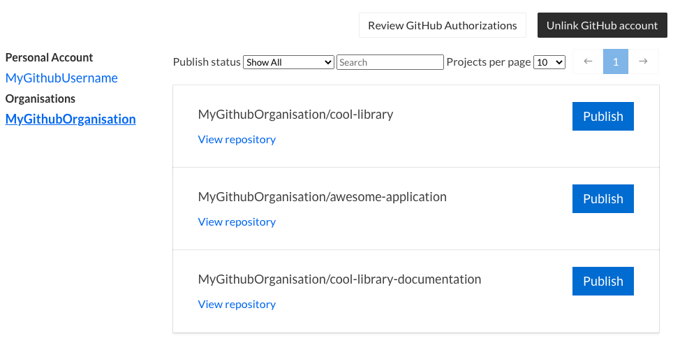
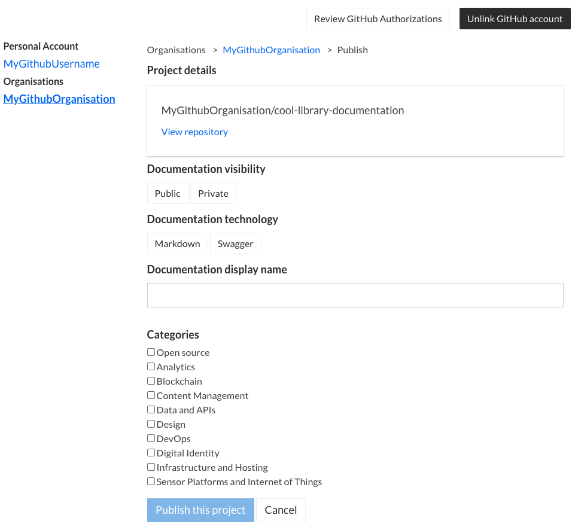

# Overview


## Prerequisites

The developer documentation portal syncs up your documentation repository containing Markdown or OpenAPI(Swagger) files and hosts them as documentation pages.

You will need:

1. A [TechPass](https://www.techpass.gov.sg) account to log in and host your documentation.
2. A free [github.com](https://github.com) account to host your documentation's git repository.
3. The following requires you to reach out to the Developer's Portal Team
   - You have been assigned the role of a publisher. 
   - A 'Product' has been created for the documentation which you are writing for, and you have been added as a team member in said 'Product'.

If your documentation is in Markdown, you will use [Docsify](https://docsify.js.org) to write and structure it on your development machine before pushing it to your GitHub repository.

If your documentation is in OpenAPI/Swagger, i.e. you are writing API documentation, you will use [ReDoc](https://github.com/Redocly/redoc) to view it on your development machine before pushing your `swagger.json` file to your GitHub repository.

## Overview of steps
<div style="text-align:center">
   
   
</div>

1. Create a new GitHub repository to place your documentation
2. Push your documentation files to that repository
3. Log in to the developer documentation portal with your TechPass account
4. Go through the guided publishing flow when you access **Publish documentation** in your product's page:
   1. Authorise developer documentation portal to access your GitHub repository's contents.
   2. Select the repository containing your documentation and publish it on the developer documentation portal.

## Quickstart


The following steps show how to publish a markdown-based documentation repo.

## Markdown
### 1. Create your Docsify project

The easiest way to get started with Docsify is through its [command line tool](https://docsify.js.org/#/quickstart).

1. You will need to have Node.js and NPM installed on your machine. Use the [official installer](https://nodejs.org/en/) or the [nvm tool](https://github.com/nvm-sh/nvm).

2. Create a Git repository to hold your documentation.

   ```bash
   mkdir my-docs
   cd my-docs
   git init
   ```

3. Use the [Docsify CLI](https://docsify.js.org/#/quickstart) to generate a documentation site. This creates the README.md and index.html files within your working directory.

   ```bash
   # Install Docsify CLI
   npm install -g docsify-cli
   # Creates an index.html and README.md within your working directory
   docsify init .
   ```

4. Start up a live-reloading server for your documentation. Open a browser and view it at http://localhost:3000.

   ```bash
   # View your documentation at http://localhost:3000
   docsify serve .
   ```

5. Commit your markdown files

   ```bash
   git add --all
   git commit -m "Initial commit"
   ```

6. [Create a new github.com repository](https://github.com/new) (this can be either public or private) and follow
   the instructions on GitHub to push your new repository to that project.

   ```bash
   # Either SSH authentication
   git remote add origin git@github.com/my-username/my-project.git
   # Or HTTP
   git remote add origin https://github.com/my-username/my-project.git

   # Push to the master branch of your GitHub project
   git push -u origin master
   ```

   Note that you should have at least a `README.md` file at the **root** of your project, which will serve as the home page for your documentation.


## OpenAPI specs


From the [official OpenAPI specification site](https://swagger.io/specification):

> The OpenAPI Specification (OAS) defines a standard, language-agnostic interface to RESTful APIs which allows both humans and computers to discover and understand the capabilities of the service without access to source code, documentation, or through network traffic inspection.
>
> An OpenAPI document (or set of documents) defines or describes an API. An OpenAPI definition uses and conforms to the OpenAPI Specification.

You can defined an OpenAPI or Swagger document in `yaml` or `json` and publish that on the developer documentation portal. It would be rendered as a human-readable page using the [ReDoc](https://github.com/Redocly/redoc) engine.


**<small>Note: This file must be named `swagger.json`, `swagger.yml` or `swagger.yaml`!</small>**

#### Previewing your OpenAPI documentation
You can use the [redoc CLI](https://github.com/Redocly/redoc/tree/master/cli) to preview how your API documentation would look like. You will need to have Node.js and NPM installed on your machine. Use the [official installer](https://nodejs.org/en/) or the [nvm tool](https://github.com/nvm-sh/nvm).

```bash
npm i -g redoc-cli
redoc-cli serve swagger.yml
```

You can then navigate to http://localhost:8080 to preview your rendered API documentation:


### 2. Log in to Documentation Portal with TechPass and go to your Product space

Log in to the developer documentation portal by clicking on `Log in with TechPass` on the nav bar. Navigate to `Team Docs` to see a list of Products that you are a member of (Contact the Developer's Portal Team for creation and addition of members to products).

Select the Product of which you are intending to publish documentation for, then click on the "Publish documentation" button. 

<!-- You will be directed to your GitHub account and you will have to grant OAuth permissions for the documentation portal to pull the contents of your documentation repository and host it. -->

### 3. Publish your documentation with the guided Publishing Wizard
> Make sure you have **pushed** changes made to your documentation files to the master branch on GitHub!

The publishing wizard will guide you through the steps required to get your documentation published.
#### Step 1. Select a Git Provider


In this step, you select a git provider (only GitHub available for now, but more options coming soon!) and authorise your account to Documentation Portal with the necessary permissions to perform publishing.
#### Step 2. Select a Repository


In this step, you select a repository from your GitHub account to link up to your to-be published documentation. Your personal repositories along with the repositories of any organisation/teams of which your GitHub account is an admin of, will be available for selection. You can toggle these options under the 'Account' dropdown selection.
#### Step 3. Enter Document Details


In this step, you provide details regarding how you want your documentation to be categorised and displayed. Some example options are, the display name, description, git branch, visibility option (public/private) and more.

#### Step 4. Summary
This is the final step where you review your repository selection and inputs. Upon verifying that all configurations are in order, click on 'Publish Documentation' to have your documentation published!

<!-- Once your GitHub repository is linked to the documentation portal, you will be able to publish it from the documentation portal.

From the top navigation bar, go to `Browse Docs` > `My Docs`. You should see the your personal or organisational GitHub accounts that developer documentation portal is connected with. Find the GitHub repository containing your documentation and click "Publish". -->

<!-- 

In the publish menu:

1. Set "Documentation visibility" to "Public" or "Private"
2. Set "Documentation Technology" to "Markdown".
3. Fill in the display name for your documentation page.
4. Click "Publish this project".

 -->

Once published, your documentation will be hosted at docs.developer.gov.sg. All changes made to your GitHub repository would be automatically
synced to the documentation portal.

> When published, every push to your documentation repo will be automatically pulled and served by the documentation portal. You can also configure the branch that is published.

<!-- ## Quickstart (OpenAPI specs)

From the [official OpenAPI specification site](https://swagger.io/specification):

> The OpenAPI Specification (OAS) defines a standard, language-agnostic interface to RESTful APIs which allows both humans and computers to discover and understand the capabilities of the service without access to source code, documentation, or through network traffic inspection.
>
> An OpenAPI document (or set of documents) defines or describes an API. An OpenAPI definition uses and conforms to the OpenAPI Specification.

You can defined an OpenAPI or Swagger document in `yaml` or `json` and publish that on the developer documentation portal. It would be rendered as a human-readable page using the [ReDoc](https://github.com/Redocly/redoc) engine.

### 1. Create a git repo

### 2. Commit your OpenAPI/Swagger spec as `swagger.json` within the repo

**<small>Note: This file must be named `swagger.json`, `swagger.yml` or `swagger.yaml`!</small>**

#### Previewing your OpenAPI documentation
You can use the [redoc CLI](https://github.com/Redocly/redoc/tree/master/cli) to preview how your API documentation would look like. You will need to have Node.js and NPM installed on your machine. Use the [official installer](https://nodejs.org/en/) or the [nvm tool](https://github.com/nvm-sh/nvm).

```bash
npm i -g redoc-cli
redoc-cli serve swagger.yml
```

You can then navigate to http://localhost:8080 to preview your rendered API documentation:


### 3. Push your repo to GitHub -->

### 4. Log in and link your TechPass account to your GitHub account

Log in to the developer documentation portal by clicking on `Log in with TechPass`. Navigate to `Browse Docs` > `My Docs` and click on the "authorize to GitHub" link. You will be directed to your GitHub account and you will have to grant OAuth permissions for the documentation portal to pull the contents of your documentation repository and host it.

### 5. Publish your API documentation

From the top navigation bar, go to `Browse Docs` > `My Docs`. You should see the your personal or organisational GitHub accounts that documentation portal is connected with. Find the GitHub repository containing your documentation and click "Publish".


In the publish menu:

1. Set "Documentation visibility" to "Public" or "Private".
2. Set "Documentation Technology" to "OpenAPI/Swagger".
3. Fill in the display name for your documentation page.
4. Click "Publish this project".

Once published, your documentation will be hosted at docs.developer.gov.sg. All changes made to your GitHub repository would be automatically
synced to the documentation portal.

> When published, every push to your documentation repo will be automatically pulled and served by the documentation portal. You can also configure the branch that is published.