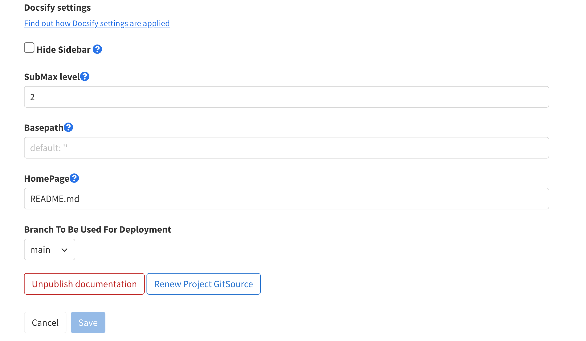

# Maintenance

There are some maintenance that doc portal has and this portion of the document will go through them.

## Renew Gitlab Project Access Token

The GitLab project access token has a validity of 365 days and must be renewed before it expires to avoid synchronization issues between your repository and documentation. To renew the GitLab project access token:

   1. Access the 'Manage Documentation' page for a document that was published using the GitLab project access token.
   2. Click on the 'Renew Project GitSource' button. This action will renew the token and update the existing documentation with the new token.
      
   